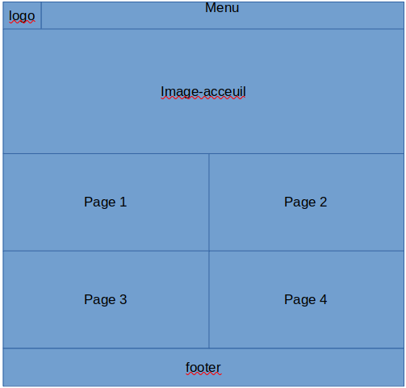
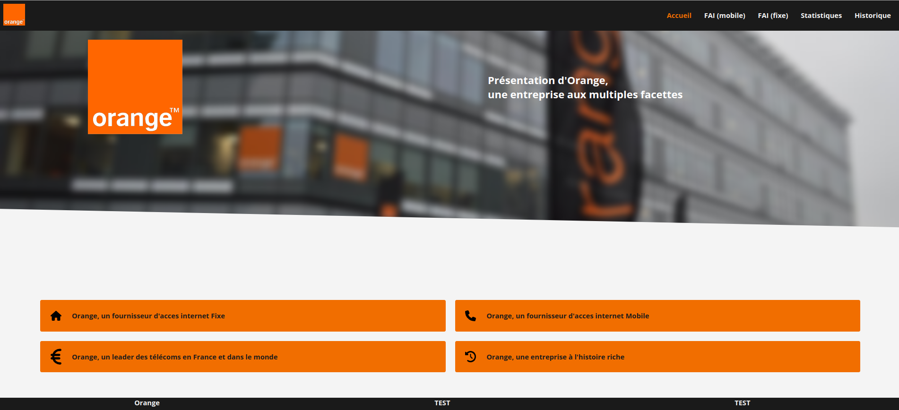
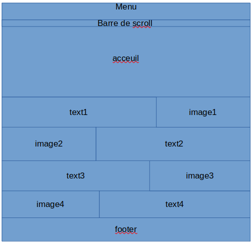
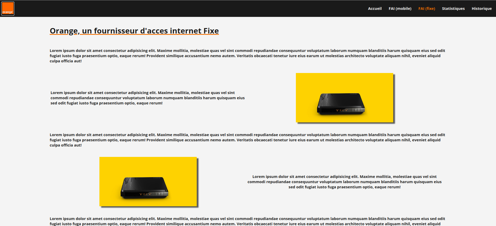

# https://chevalierthomas.github.io/orangeWebsite/index.html
Orange Project

## Les membres :

| Thomas CHEVALIER (responsable) | <thomas.chevalier@edu-univ-fcomte.fr> |
| Clément MENAUCOURT | <clement.menaucourt@edu-univ-fcomte.fr> |
| Stévann CAMOZZI | <stevann.camozzi@edu.univ-fcomte.fr> |
| Romain MEYER | <romain.meyer04@edu.univ-fcomte.fr> |
| Alexis MARICHY | <alexis.marichy@edu.univ-fcomte.fr> |

## Le rapport économique :

[Rapport économique orange](./doc/CHEVALIER_Thomas_Orange_S1.pdf)

## Zoning et Prototype des page :

### Accueil zoning :

### Accueil prototype :

### Page zoning : 

### Page prototype :

## W3C :

[Vérifications de W3C](./doc/validation.pdf)
